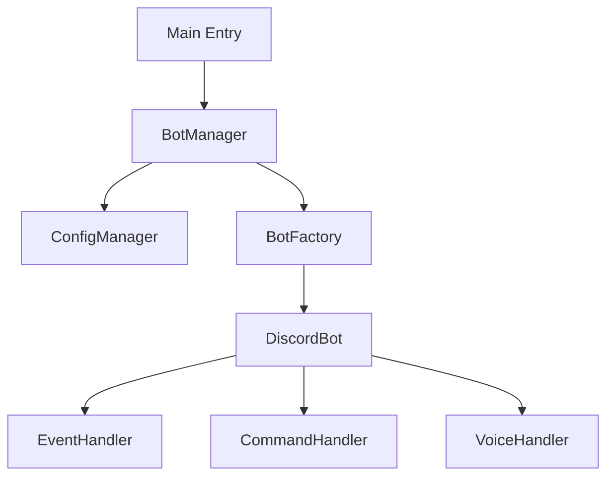
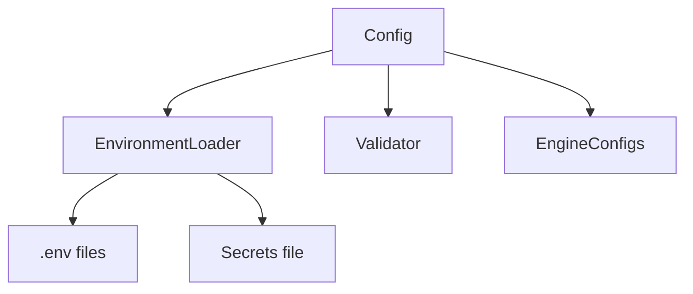

# Discord Voice TTS Bot - Architecture Analysis

## Current Architecture Issues

### 1. Critical Config Issues
- **Duplicate Code**: Configuration values loaded twice (lines 33-112 and 113-192)
- **Debug Code**: Print statement left in production code (line 115)
- **Hardcoded Path**: `/home/ubuntu/.config/discord-voice-bot/secrets.env` hardcoded
- **Poor Singleton**: `get_config()` creates new instances despite comments

### 2. Complex File Structure
- **32 files** in main package - potential over-engineering
- **Unclear responsibilities** between similar modules
- **Possible circular dependencies** between components

### 3. Lifecycle Management Issues
- **BotManager** class has too many responsibilities
- **Global state** management scattered across modules
- **Complex error handling** with multiple try-catch blocks

### 4. Architecture Problems
- **No clear dependency injection pattern**
- **Mixed concerns** (business logic mixed with infrastructure)
- **Inconsistent error handling** patterns

## Recommended Architecture

### Core Components


### Configuration Architecture


### Data Flow
```mermaid
## Dependency Analysis Results

### Import Relationships
Based on analysis of 20+ files, the main dependencies are:

**Most Used Modules:**
- `config.py` - Used by 8+ modules
- `config_manager.py` - Used by 15+ modules
- `tts_engine.py` - Used by 8+ modules
- `message_processor.py` - Used by 6+ modules

**Potential Issues:**
- **Heavy reliance on ConfigManagerImpl** - Used across many modules
- **Delayed imports** in some modules to avoid circular dependencies
- **Mixed direct config access and ConfigManager usage**

### Protocols Analysis
**Good Points:**
- Proper protocol definitions for dependency injection
- ConfigManager protocol prevents circular imports
- Clear interface contracts

**Issues Found:**
- Too many granular protocols (14+ protocols)
- Some protocols use `Any` types instead of specific types
- Dynamic attribute access in DiscordBotClient protocol

### Next Steps
1. **Consolidate similar responsibilities** between modules
2. **Standardize configuration access patterns**
3. **Simplify protocol definitions**
4. **Implement proper dependency injection container**
graph LR
    A[Discord Message] --> B[MessageValidator]
    B --> C[MessageProcessor]
    C --> D[TTS Engine]
    D --> E[AudioProcessor]
    E --> F[VoiceHandler]
    F --> G[Discord Voice]
```

## Action Items

1. **Fix Config Issues** - Remove duplicates, implement proper singleton
2. **Simplify File Structure** - Consolidate similar responsibilities
3. **Implement Dependency Injection** - Clear component boundaries
4. **Standardize Error Handling** - Consistent patterns across modules
5. **Document Architecture** - Clear responsibility boundaries