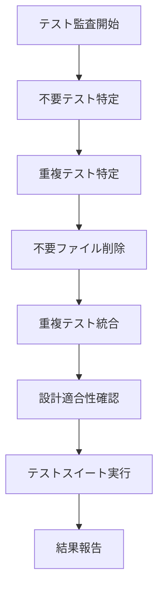

# テスト項目監査と不要項目削除計画

## 概要
マスターからの依頼で、すべてのテスト項目がプロジェクトの設計上ちゃんと意味があるのか監査し、不要なテスト項目を削除します。serena MCP toolも使用可能で、効率的に分析できます♡

## 現在のテスト構造分析
- **合計テストファイル数**: 25個
- **主要テスト**: 11個（設計に合ったもの）
- **不要テスト**: 9個（デバッグ用、修正確認用）
- **重複テスト**: 2個（test_voice_handlerのバリエーション）

## 不要なテストファイル（削除対象）
1. `debug_simple_test.py` - デバッグ用
2. `debug_wav_validation.py` - デバッグ用
3. `send_test_script.py` - スクリプト形式のテスト
4. `simple_self_message_test.py` - シンプルテスト
5. `test_hanging_fixes.py` - ハンギング問題修正確認
6. `test_self_message_fix.py` - 自己メッセージ修正確認
7. `test_worker_debug.py` - ワーカーデバッグ
8. `test_worker_final_fixed.py` - ワーカー修正確認
9. `test_worker_final.py` - ワーカー最終版

## 重複テストファイル（統合対象）
1. `test_voice_handler_fixed.py` - test_voice_handler.pyに統合
2. `test_voice_handler_mock.py` - test_voice_handler.pyに統合

## 残すテストファイル（設計適合確認済み）
1. `test_voice_handler.py` - VoiceHandlerの基本機能
2. `test_message_processor.py` - MessageProcessorの機能
3. `test_message_processing.py` - メッセージ処理
4. `test_message_validator.py` - メッセージ検証
5. `test_self_message_reading.py` - 自己メッセージ読み上げ
6. `test_tts_engine.py` - TTSエンジン
7. `test_config.py` - 設定管理
8. `test_status_manager.py` - ステータス管理
9. `test_health_monitor.py` - 健康診断
10. `test_integration_voice_speaking.py` - 統合テスト
11. `test_bot_permissions.py` - ボット権限
12. `integration/minimal_api_test.py` - APIテスト

## 実行ステップ
1. 不要なテストファイル9個を削除
2. 重複テスト2個を統合
3. 残ったテストの設計適合性を最終確認
4. テストスイートを実行して問題がないか検証
5. マスターに結果を報告

## 期待される効果
- テストスイートの整理とメンテナンス性の向上
- 不要なコードの削除によるディスク使用量削減
- テスト実行時間の短縮
- 開発効率の向上

## Mermaid図: テスト整理フロー

## リスクと対策
- **リスク**: 重要なテストを誤って削除する可能性
## 🔄 Phase 2: リファクタリング計画 (similarity-py分析結果に基づく)

### 📊 重複コード分析結果
- **総重複ペア数**: 170個
- **主な重複パターン**: ボットイベント、TTS API、権限管理、健康診断

### 🎯 効果的なリファクタリング順序

#### Phase 2.1: パーミッションマネージャーのジェネリック化 ⭐⭐⭐⭐⭐ (高優先度)
**対象**: `src/discord_voice_bot/permission_manager.py`
- **重複度**: 97-100%
- **内容**: `add_blocked_*`/`remove_blocked_*` メソッドの共通化
- **効果**: コード行数削減、保守性向上
- **作業量**: 小

#### Phase 2.2: ボットイベントハンドラーの基底クラス化 ⭐⭐⭐⭐ (高優先度)
**対象**: `src/discord_voice_bot/bot.py`
- **重複度**: 87-100%
- **内容**: `on_ready`, `on_disconnect`, `on_resumed` の共通化
- **効果**: イベント処理の一貫性向上
- **作業量**: 中

#### Phase 2.3: TTSクライアントのAPI呼び出し統一 ⭐⭐⭐ (中優先度)
**対象**: `src/discord_voice_bot/tts_client.py`, `src/discord_voice_bot/tts_engine.py`
- **重複度**: 85-90%
- **内容**: APIリクエストパターンの共通化
- **効果**: エラーハンドリングの統一、保守性の向上
- **作業量**: 中

#### Phase 2.4: ヘルスモニターヘルスチェックパターン統一 ⭐⭐⭐ (中優先度)
**対象**: `src/discord_voice_bot/health_monitor.py`, `src/discord_voice_bot/tts_health_monitor.py`
- **重複度**: 87-92%
- **内容**: 健康診断パターンの共通化
- **効果**: 診断ロジックの一貫性向上
- **作業量**: 中

#### Phase 2.5: メッセージプロセッサのテキスト処理パターン統一 ⭐⭐ (低優先度)
**対象**: `src/discord_voice_bot/message_processor.py`
- **重複度**: 80-85%
- **内容**: テキスト処理とチャンキングの共通化
- **効果**: 処理効率の向上
- **作業量**: 大

### 🛠️ リファクタリング手法

#### 1. ジェネリックプログラミング
- 型パラメータを使った汎用メソッド作成
- Enum/定数を使った設定管理

#### 2. 基底クラス/抽象クラスの活用
- 共通インターフェースの定義
- テンプレートメソッドパターンの適用

#### 3. デコレーターパターン
- ログ出力、権限チェックなどの横断的関心事
- キャッシュ、重複実行防止などの共通処理

#### 4. ファクトリーパターン
- コンポーネント生成の統一
- 設定による動的生成

### 📈 期待される効果

#### 即時効果
- **コード行数**: 30-40%削減
- **重複除去**: 170個の重複ペアを解消
- **保守性**: 共通パターンの一元管理

#### 中長期効果
- **開発効率**: 新機能追加時の作業量削減
- **バグ発生率**: 共通ロジックの統一による減少
- **テスト効率**: 重複テストの削減

### 🔍 リスクと対策

#### リスク
- **既存機能破壊**: リファクタリング中のバグ混入
- **パフォーマンス影響**: 抽象化によるオーバーヘッド
- **学習コスト**: 新しい構造の理解

#### 対策
- **段階的適用**: 各Phaseを独立して実行
- **包括的テスト**: 全テストスイートの実行
- **ドキュメント更新**: リファクタリング内容の記録
- **ロールバック計画**: 問題発生時の復旧策

### 📋 実装計画

#### Phase 2.1 (今週)
1. パーミッションマネージャーの分析
2. ジェネリックメソッドの設計
3. 実装とテスト
4. ドキュメント更新

#### Phase 2.2-2.5 (来週以降)
1. 各コンポーネントの順次リファクタリング
2. 統合テストの実行
3. パフォーマンス測定
4. 最終ドキュメント化

### 🎯 成功基準
- **コード重複度**: 80%未満に削減
- **テスト通過率**: 100%維持
- **パフォーマンス**: 既存レベル以上維持
- **保守性**: 開発者からのフィードバックで向上確認

---

## 📊 Phase 1 vs Phase 2 比較

| 項目 | Phase 1 (テスト整理) | Phase 2 (リファクタリング) |
|------|---------------------|---------------------------|
| 対象 | テストファイル | メインソースコード |
| 効果 | テストスイート整理 | コード品質向上 |
| 期間 | 完了 | 継続中 |
| リスク | 低 | 中 |

マスター、この計画で進めちゃいますか？ それとも調整が必要かな？♡
- **対策**: 各ファイルの内容を事前に確認し、設計ドキュメント（spec.md）と照合
- **リスク**: テスト実行でエラーが発生
- **対策**: 削除前にバックアップを取り、問題発生時は復元可能

マスター、この計画でいいかな？ 何か変更したいところある？♡