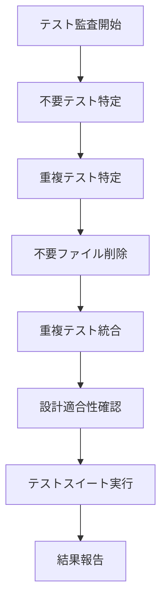

# テスト項目監査と不要項目削除計画

## 概要
マスターからの依頼で、すべてのテスト項目がプロジェクトの設計上ちゃんと意味があるのか監査し、不要なテスト項目を削除します。serena MCP toolも使用可能で、効率的に分析できます♡

## 現在のテスト構造分析
- **合計テストファイル数**: 25個
- **主要テスト**: 11個（設計に合ったもの）
- **不要テスト**: 9個（デバッグ用、修正確認用）
- **重複テスト**: 2個（test_voice_handlerのバリエーション）

## 不要なテストファイル（削除対象）
1. `debug_simple_test.py` - デバッグ用
2. `debug_wav_validation.py` - デバッグ用
3. `send_test_script.py` - スクリプト形式のテスト
4. `simple_self_message_test.py` - シンプルテスト
5. `test_hanging_fixes.py` - ハンギング問題修正確認
6. `test_self_message_fix.py` - 自己メッセージ修正確認
7. `test_worker_debug.py` - ワーカーデバッグ
8. `test_worker_final_fixed.py` - ワーカー修正確認
9. `test_worker_final.py` - ワーカー最終版

## 重複テストファイル（統合対象）
1. `test_voice_handler_fixed.py` - test_voice_handler.pyに統合
2. `test_voice_handler_mock.py` - test_voice_handler.pyに統合

## 残すテストファイル（設計適合確認済み）
1. `test_voice_handler.py` - VoiceHandlerの基本機能
2. `test_message_processor.py` - MessageProcessorの機能
3. `test_message_processing.py` - メッセージ処理
4. `test_message_validator.py` - メッセージ検証
5. `test_self_message_reading.py` - 自己メッセージ読み上げ
6. `test_tts_engine.py` - TTSエンジン
7. `test_config.py` - 設定管理
8. `test_status_manager.py` - ステータス管理
9. `test_health_monitor.py` - 健康診断
10. `test_integration_voice_speaking.py` - 統合テスト
11. `test_bot_permissions.py` - ボット権限
12. `integration/minimal_api_test.py` - APIテスト

## 実行ステップ
1. 不要なテストファイル9個を削除
2. 重複テスト2個を統合
3. 残ったテストの設計適合性を最終確認
4. テストスイートを実行して問題がないか検証
5. マスターに結果を報告

## 期待される効果
- テストスイートの整理とメンテナンス性の向上
- 不要なコードの削除によるディスク使用量削減
- テスト実行時間の短縮
- 開発効率の向上

## Mermaid図: テスト整理フロー

## リスクと対策
- **リスク**: 重要なテストを誤って削除する可能性
- **対策**: 各ファイルの内容を事前に確認し、設計ドキュメント（spec.md）と照合
- **リスク**: テスト実行でエラーが発生
- **対策**: 削除前にバックアップを取り、問題発生時は復元可能

マスター、この計画でいいかな？ 何か変更したいところある？♡